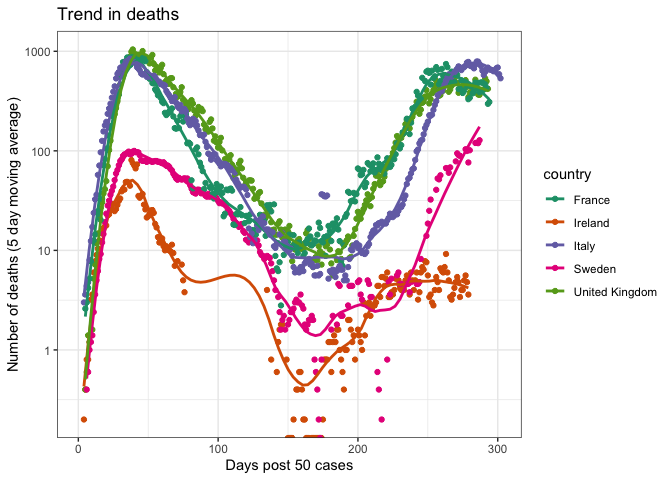

COVID analysis
================
Jon Yearsley
15 April, 2020

A quick look at the European data on Covid-19.

Data downloaded from two sources

  - European Centre for Diesease Prevention and Control (ECDPC).
    <https://www.ecdc.europa.eu/en>

  - Johns Hopkins University Center for Systems Science and Engineering
    (CSSE), <https://github.com/CSSEGISandData/COVID-19>

## Select countries to visualise

``` r
countryList = c('Ireland',
            'United_Kingdom',
            'United Kingdom',
            'France',
            'Austria')
```

## Download data

Data from ECDPC

``` r
download.file(url='https://www.ecdc.europa.eu/sites/default/files/documents/COVID-19-geographic-disbtribution-worldwide.xlsx',
              destfile='COVID-19-geographic-disbtribution-worldwide.xlsx')

d_ecdpc= read_excel("COVID-19-geographic-disbtribution-worldwide.xlsx")
d_ecdpc = subset(d_ecdpc, countriesAndTerritories%in%countryList)
d_ecdpc$country = as.factor(d_ecdpc$countriesAndTerritories)
d_ecdpc$julian = as.numeric(julian(d_ecdpc$dateRep))
d_ecdpc$ID = c(1:nrow(d_ecdpc))

# Order deaths by time
ind = order(d_ecdpc$julian, d_ecdpc$country) 
d_ecdpc= d_ecdpc[ind,]

d_ecdpc$cumdeaths = ave(d_ecdpc$deaths, 
                        d_ecdpc$country, 
                        FUN=function(x){cumsum(x)})

d_ecdpc$dataSource='ECDPC'
```

Data from CSSE

``` r
url_csse = 'https://raw.githubusercontent.com/CSSEGISandData/COVID-19/master/csse_covid_19_data/csse_covid_19_time_series/'
cases_filename = 'time_series_covid19_confirmed_global.csv'
deaths_filename = 'time_series_covid19_deaths_global.csv'
d_cases = read.csv(url(paste0(url_csse, cases_filename)))
d_deaths = read.csv(url(paste0(url_csse, deaths_filename)))

tmp = droplevels(subset(d_cases, Country.Region%in%countryList))
d1 = pivot_longer(data=tmp, 
                 cols = c(5:ncol(tmp)), 
                 names_to='dateStr', 
                 values_to='cumcases')

tmp = droplevels(subset(d_deaths, Country.Region%in%countryList))
d2 = pivot_longer(data=tmp, 
                 cols = c(5:ncol(tmp)), 
                 names_to='dateStr', 
                 values_to='cumdeaths')

d_csse = aggregate(cbind(cumcases,cumdeaths) ~ dateStr + Country.Region, 
                    data=merge(d1,d2), 
                    FUN=sum, na.rm=TRUE)

d_csse$dateRep = as.POSIXct(strptime(d_csse$dateStr, format='X%m.%d.%y'))
d_csse$julian = as.numeric(julian(d_csse$dateRep))
d_csse$cumcases = as.double(d_csse$cumcases)
d_csse$cumdeaths = as.double(d_csse$cumdeaths)

vars = names(d_csse)
vars[2] = 'country'
names(d_csse) = vars

# Order deaths by time
ind = order(d_csse$julian, d_csse$country) 
d_csse= d_csse[ind,]

# Calculate number of new cases and number of new deaths
for (c in countryList) {
  tmp = subset(d_csse, country==c)
  if (nrow(tmp)>0) {
    tmp$cases = c(tmp$cumcases[1], diff(tmp$cumcases))
    tmp$deaths = c(tmp$cumdeaths[1], diff(tmp$cumdeaths))
    
    if (c==countryList[1]) {
      d_csse_final = tmp
    } else {
      d_csse_final = rbind(d_csse_final, tmp)
    }
  }
}

d_csse_final$dataSource='CSSE'
```

-----

Find day when number of new cases exceeded X (where X is typically set
at 50-300)

``` r
casesThreshold = 50
casesStr = paste0('Days post ',casesThreshold,' cases') # String for graph labels

# Function to calculate days into epidemic
add_daysIn = function(d, threshold) {
  dplus = subset(d, cases>threshold)
  startDate = aggregate(julian~country, 
                        data=dplus, 
                        FUN=function(x) {min(x)})
  
  ind = match(dplus$country,
              startDate$country)
  dplus$daysIn = dplus$julian - startDate$julian[ind]
  return(dplus)
}

varKeep = c('dataSource','dateRep','country','julian',
            'cases','deaths','cumdeaths')


d2 = as.data.frame(rbind(add_daysIn(d_ecdpc[,varKeep], casesThreshold),
           add_daysIn(d_csse_final[,varKeep], casesThreshold)))

d2$dataSource = as.factor(d2$dataSource)
d2$dateRep = as.Date(d2$dateRep)
```

Calculate rolling average over a window (nominally 7 days). One reason
for doing this is because there’s uncertainty in the dates due to the
time it takes for deaths and cases to be registered, etc.

``` r
dayWindow = 5
rollingStr = paste0('(',dayWindow,' day moving average)')  # String for graph labels
for (i in countryList) {
  for (s in c('CSSE','ECDPC')) {
    tmp=subset(d2, country==i & dataSource==s)
    tmp$deaths_rolling = rollmean(tmp$deaths, k=dayWindow, align='right', fill=NA)
    tmp$cumdeaths_rolling = rollmean(tmp$cumdeaths, k=dayWindow, align='right', fill=NA)
    tmp$cases_rolling = rollmean(tmp$cases, k=dayWindow, align='right', fill=NA)
    
    if (i==countryList[1] & s=='CSSE') {
      d3 = tmp
    } else {
      d3 = rbind(d3, tmp)
    }
  }
}
```

# Visualisations

### Tables of the latest new cases and deaths per country

``` r
library(pander)
ind = aggregate(julian~dataSource+country, 
                data=d3, 
                FUN=max)

pander(d3[d3$julian%in%ind$julian,
          c('dataSource',
                   'country', 
                   'dateRep',
                   'daysIn',
                   'cases',
                   'deaths',
                   'cumdeaths')],
       col.names=c('Database',
                   'Country',
                   'Date',
                   paste('Days post\n',casesThreshold,'cases'),
                   'New \nCases',
                   'New \nDeaths',
                   'Total deaths'),
       caption='Table 1: The latest numbers from the European Centre for Diesease Prevention and Control (ECDPC). https://www.ecdc.europa.eu/en and Johns Hopkins University Center for Systems Science and Engineering (CSSE), https://github.com/CSSEGISandData/COVID-19',
       keep.line.breaks = TRUE,
       row.names=FALSE)
```

| Database |     Country     |    Date    | Days post 50 cases | New Cases | New Deaths | Total deaths |
| :------: | :-------------: | :--------: | :----------------: | :-------: | :--------: | :----------: |
|   CSSE   |     Ireland     | 2020-04-12 |       26.96        |    992    |     31     |     365      |
|   CSSE   |     Ireland     | 2020-04-13 |       27.96        |    832    |     41     |     406      |
|  ECDPC   |     Ireland     | 2020-04-15 |         29         |    832    |     41     |     406      |
|  ECDPC   | United\_Kingdom | 2020-04-15 |         37         |   5252    |    778     |    12107     |
|   CSSE   | United Kingdom  | 2020-04-12 |       35.96        |   4364    |    718     |    11347     |
|   CSSE   | United Kingdom  | 2020-04-13 |       36.96        |   5275    |    782     |    12129     |
|   CSSE   |     France      | 2020-04-12 |       41.96        |   4205    |    574     |    14986     |
|  ECDPC   |     France      | 2020-04-15 |         41         |   5497    |    762     |    15729     |
|   CSSE   |     Austria     | 2020-04-12 |       33.96        |    96     |     18     |     368      |
|   CSSE   |     Austria     | 2020-04-13 |       34.96        |    185    |     16     |     384      |
|  ECDPC   |     Austria     | 2020-04-15 |         35         |    191    |     16     |     384      |

Table 1: The latest numbers from the European Centre for Diesease
Prevention and Control (ECDPC). <https://www.ecdc.europa.eu/en> and
Johns Hopkins University Center for Systems Science and Engineering
(CSSE), <https://github.com/CSSEGISandData/COVID-19>

### Temporal trends

<!-- -->

<!-- -->

<!-- -->

### Epidemic indicator

<!-- -->

Fit a linear trend and plot residuals

``` r
d3sub = subset(d3,dataSource=='ECDPC')
m = lm(log10(deaths_rolling)~(1+log10(cumdeaths_rolling))*country, 
       data=d3sub, 
       na.action=na.exclude)
```

Plot residuals from these linear trends

``` r
d3sub$residuals = residuals(m)
d3sub$fitted = fitted(m)

p5 = ggplot(data=d3sub,
       aes(x=fitted, 
           y=residuals, 
           colour=country)) +
  geom_abline(intercept=0, slope=0) +
  geom_point(na.rm=T) + 
  geom_smooth(method = 'loess', 
              span=0.75,
              se=FALSE,
              na.rm=T) +
  scale_color_brewer(palette = 'Dark2') +
  theme_bw() + 
  labs(x=paste0('Fitted for log10(number of deaths)'),
       y=paste0('Residuals from linear regression'),
       title='Residuals from cumulative verus current deaths')

#ggplotly(p5)
p5
```

<!-- -->

<!-- -->
