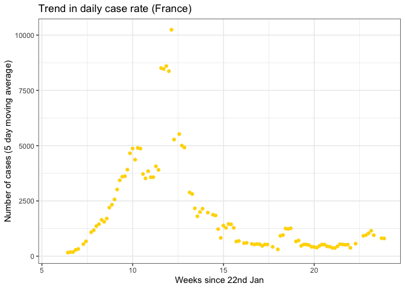

COVID stats for Moran et al (2020) paper
================
Jon Yearsley
07 July, 2020

A quick look at the data on Covid-19.

Data downloaded from

  - Johns Hopkins University Center for Systems Science and Engineering
    (CSSE), <https://github.com/CSSEGISandData/COVID-19>

## Select countries to visualise

``` r
countryList = c('Ireland',
            'United Kingdom',
            'Italy',
            'Spain',
            'France',
            'Germany',
            'Switzerland')
```

## Download data

Data from CSSE

-----

Find day when number of new cases exceeded X (where X is typically set
at 50-300)

Calculate rolling average over a window (roughly 5- 7 days). One reason
for doing this is because there’s uncertainty in the dates due to the
time it takes for deaths and cases to be registered, etc.

# Visualisations

### Tables of stats at peak daily deaths

|    Country     | Max Deaths |    Date    | New Cases | Days post 50 cases | Cumulative deaths |
| :------------: | :--------: | :--------: | :-------: | :----------------: | :---------------: |
|     France     |    1438    | 2020-04-14 |   3220    |       43.96        |       17169       |
|    Germany     |    510     | 2020-04-14 |   3394    |       44.96        |       3804        |
|    Ireland     |    220     | 2020-04-23 |    577    |       37.96        |       1014        |
|     Italy      |    919     | 2020-03-27 |   5909    |         33         |       9134        |
|     Spain      |    1179    | 2020-06-18 |    307    |        107         |       28315       |
|  Switzerland   |     75     | 2020-04-03 |    899    |       28.96        |        666        |
| United Kingdom |    1172    | 2020-04-20 |   4775    |       48.96        |       20264       |

Table 1: The numbers when deaths peaked. Data from Johns Hopkins
University Center for Systems Science and Engineering (CSSE),
<https://github.com/CSSEGISandData/COVID-19> (continued below)

| Weeks since 22nd Jan |
| :------------------: |
|        11.99         |
|        11.99         |
|        13.28         |
|        9.286         |
|        21.28         |
|        10.42         |
|        12.85         |

### Temporal trends

<!-- -->

<!-- -->
<!-- -->

<!-- -->

<!-- -->

<!-- -->

<!-- -->
