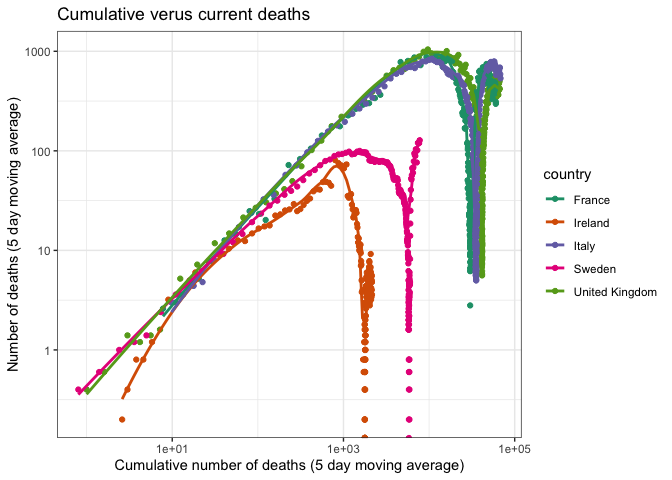

COVID stats for Moran et al (2020) paper
================
Jon Yearsley
07 July, 2020

A quick look at the data on Covid-19.

Data downloaded from

  - Johns Hopkins University Center for Systems Science and Engineering
    (CSSE), <https://github.com/CSSEGISandData/COVID-19>

## Select countries to visualise

``` r
countryList = c('Ireland',
            'United Kingdom',
            'Italy',
            'Spain',
            'France',
            'Germany',
            'Switzerland')
```

## Download data

Data from CSSE

-----

Find day when number of new cases exceeded X (where X is typically set
at 50-300)

Calculate rolling average over a window (roughly 5- 7 days). One reason
for doing this is because there’s uncertainty in the dates due to the
time it takes for deaths and cases to be registered, etc.

# Visualisations

### Tables of stats at peak daily deaths

|    Country     | Max Deaths (5 day mean) |    Date    | New Cases | Days post 50 cases |
| :------------: | :---------------------: | :--------: | :-------: | :----------------: |
|     France     |          1024           | 2020-04-09 |   4372    |       38.96        |
|    Germany     |           266           | 2020-04-16 |   3699    |       46.96        |
|    Ireland     |          80.8           | 2020-04-23 |    577    |       37.96        |
|     Italy      |          842.6          | 2020-03-30 |   4053    |       36.96        |
|     Spain      |           879           | 2020-04-02 |   7134    |       29.96        |
|  Switzerland   |          61.4           | 2020-04-03 |    899    |       28.96        |
| United Kingdom |          1034           | 2020-04-10 |   3613    |       38.96        |

Table 1: The numbers when deaths peaked. Data from Johns Hopkins
University Center for Systems Science and Engineering (CSSE),
<https://github.com/CSSEGISandData/COVID-19> (continued below)

| Cumulative deaths | Weeks since 22nd Jan |
| :---------------: | :------------------: |
|       13215       |        11.28         |
|       4352        |        12.28         |
|       1014        |        13.28         |
|       12428       |        9.851         |
|       11198       |        10.28         |
|        666        |        10.42         |
|       11616       |        11.42         |

### Temporal trends

<!-- -->

<!-- -->
<!-- -->

<!-- -->

<!-- -->

<!-- -->

<!-- -->
