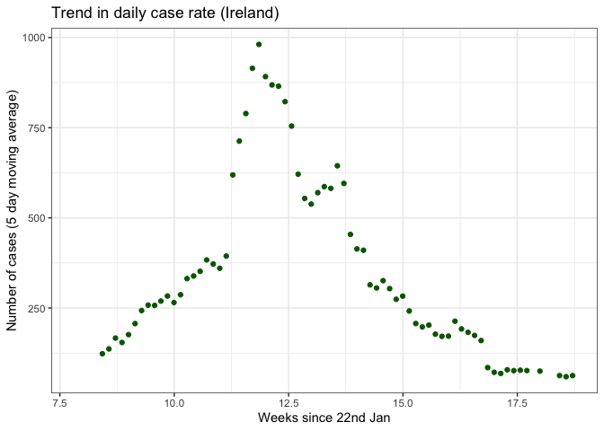

COVID analysis
================
Jon Yearsley
4/3/2020

A quick look at the European data on Covid-19.

Data downloaded from
<https://www.ecdc.europa.eu/sites/default/files/documents/COVID-19-geographic-disbtribution-worldwide.xlsx>

## Process data

``` r
d = read_excel("COVID-19-geographic-disbtribution-worldwide.xlsx")
d$countriesAndTerritories = as.factor(d$countriesAndTerritories)
d$julian = as.numeric(julian(d$dateRep))
d$ID = c(1:nrow(d))

# Order deaths by time
ind = order(d$julian, d$countriesAndTerritories) 
d = d[ind,]

d$cumdeaths = ave(d$deaths, 
                  d$countriesAndTerritories, 
                  FUN=function(x){cumsum(x)})
```

Find day when number of new cases exceeded X (where X is typically set
at 100-300)

``` r
casesThreshold = 100
casesStr = paste0('Days post ',casesThreshold,' cases') # String for graph labels
dplus = subset(d, cases>casesThreshold)
startDate = aggregate(julian~countriesAndTerritories + 
                        geoId + 
                        countryterritoryCode, 
                      data=dplus, 
                      FUN=function(x) {min(x)})

ind = match(dplus$countryterritoryCode,
            startDate$countryterritoryCode)
dplus$daysIn = dplus$julian - startDate$julian[ind]
```

Select data from some countries

``` r
country = c('Ireland',
            'Italy',
            'Sweden',
            'United_Kingdom',
            'Germany',
            'France')

d2 = subset(dplus, 
            countriesAndTerritories %in% country)
```

Calculate rolling average over a window (nominally 7 days). One reason
for doing this is because there’s uncertainty in the dates due to the
time it takes for deaths and cases to be registered, etc.

``` r
dayWindow = 7
rollingStr = paste0('(',dayWindow,' day moving average)')  # String for graph labels
for (i in 1:length(country)) {
  tmp=subset(d2, countriesAndTerritories==country[i])
  tmp$deaths_rolling = rollmean(tmp$deaths, k=dayWindow, align='right', fill=NA)
  tmp$cumdeaths_rolling = rollmean(tmp$cumdeaths, k=dayWindow, align='right', fill=NA)
  tmp$cases_rolling = rollmean(tmp$cases, k=dayWindow, align='right', fill=NA)
  
  if (i==1) {
    d3 = tmp
  } else {
    d3 = rbind(d3, tmp)
  }
}
```

# Visualisations

### Temporal trends

    ## Warning: Removed 36 rows containing non-finite values (stat_smooth).

    ## Warning: Removed 36 rows containing missing values (geom_point).

<!-- -->

    ## Warning: Removed 36 rows containing non-finite values (stat_smooth).

    ## Warning: Removed 36 rows containing missing values (geom_point).

<!-- -->

    ## Warning: Removed 36 rows containing non-finite values (stat_smooth).

    ## Warning: Removed 36 rows containing missing values (geom_point).

<!-- -->

### Epidemic indicator

    ## Warning: Removed 36 rows containing non-finite values (stat_smooth).

    ## Warning: Removed 36 rows containing missing values (geom_point).

<!-- -->
